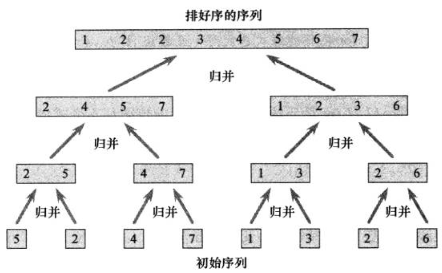

# 十大经典排序算法总结

## 0. 前言
主要总结以下十种经典的排序算法：
1. 选择排序
2. 冒泡排序
3. 插入排序
4. 希尔排序
5. 归并排序
6. 快速排序
7. 堆排序
8. 桶排序
9. 计数排序
10. 基数排序

## 1. 选择排序


## 2. 冒泡排序
冒泡排序的思路是（以从左到右升序）：

从左到右逐个逐个对比相邻元素，假如左边元素大于（>）右边元素，则左右元素进行交换，直至交换至数组尾部。这样一次交换后，数组最右边的元素最大；之后经过第二次交换后第二大、第三大的元素会相继到数组尾部，类似冒泡过程。

算法实现：
```js
function bubbleSort(arr) {
  let end = arr.length, tmp;
  while (end) {
    // 在每轮排序中，从左到右不断交换逆序对
    for (let i = 1; i < end; i++) {
      if (arr[i-1] > arr[i]) {
        tmp = arr[i-1];
        arr[i-1] = arr[i];
        arr[i] = tmp;
      }
    }
    // 每轮结束后，end--，表明其右侧为有序且最小值不小于左侧中最大值
    end --;
  }
  return arr;
}
```
该算法的时间复杂度为*O(n^2)*。

## 3. 插入排序
插入排序的过程就像我们摸牌时对扑克牌进行排序一样——扑克牌分为手中的已排序好的扑克牌和乱序的牌堆。每次我们从乱序的牌堆中抽出一张牌，将该牌从右到左和手中的已排好序的牌对比，发现合适的位置就插入该牌。当无序牌堆中的牌被摸光后，手中的就是已排好序的牌组。

算法实现：
```js
function insertionSort(arr) {
  // 中key左边认为是有序的，key右边认为是无序的，key从第二个元素开始取值
  for (let i = 1; i < arr.length; i++) {
    let key = arr[i];
    // j是左边有序数组的最后一个元素的index
    let j = i - 1;
    while (j >= 0 && key < arr[j]) {
      // 每次当key比其左边元素更小的时候，该元素需要右移一格，并依次腾出一个空位
      arr[j + 1] = arr[j];
      j --;
    }
    // 当key不再比左边元素小时，key占据该空位；注意，由于在while里面j--了，所以这里要加1
    arr[j + 1] = key;
  }
  return arr;
}
```
该算法的时间复杂度为*O(n^2)*。
## 4. 希尔排序

## 5. 归并排序
归并排序利用了分治的策略，分治策略的主要思想是：
1. 分解问题；
2. 当子问题分解到足够小，解决该子问题；
3. 合并子问题的解。

归并排序的计算过程如下图所示：


下面给出实现的代码：

```js
// [low, high)
function mergeSort(arr, low = 0, high = arr.length) {
  if (high - low > 1) {
    let mid = Math.ceil((low + high) / 2);
    mergeSort(arr, low, mid);
    mergeSort(arr, mid, high);
    merge(arr, low, mid, high);
  }
  // [low, mid) [mid, high)
  function merge(arr, low, mid, high) {
    // 先将[low, mid) 和 [mid, high) 分别复制到arrLeft和arrRight中
    let arrLeft = [];
    let arrRight = [];
    for (let i = low; i < mid; i++) {
      arrLeft.push(arr[i]);
    }
    for (let j = mid; j < high; j++) {
      arrRight.push(arr[j]);
    }
    arrLeft[arrLeft.length] = arrRight[arrRight.length] = Infinity;
    let index = low;
    while (index < high) {
      // 选择更小值
      arr[index++] = arrLeft[0] < arrRight[0] ? arrLeft.shift() : arrRight.shift();
    }
  }
}
```

## 6. 快速排序

## 排序算法总结

